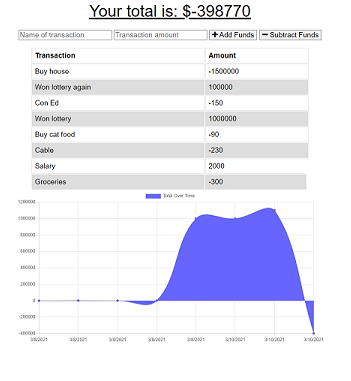

# Budget Tracker

## Description

Budget Tracker allows a user to track their budget by adding and subtracting funds via a simple web interface. A list of all transactions displays at the top of the page and a graph of the totals over time displays beneath the list. The user will be able to add expenses and deposits to their budget with or without a network connection. When entering transactions offline, they will populate the total when brought back online.

Technologies used in this project include:

* IndexedDB
* Webmanifest
* Service Worker
* MongoDB
* Chart.js

## Table of Contents

* [Installation](#installation)
* [Usage](#usage)
* [Screenshot](#screenshot)
* [Website](#website)
* [Code Repository](#repository)
* [License](#license)
* [Contributing](#contributing)
* [Tests](#tests)
* [Questions](#questions)

## Installation

1. Clone this repo.
2. Install node.js. It can be downloaded here: [node.js Downloads](https://nodejs.org/en/download/)
3. Initialize npm:
    >npm init -y
4. Install Express, Morgan, Mongoose, and Compression NPM packages:
    >npm install express morgan mongoose compression

## Usage

To run this app:

1. Open the console in the directory where the server.js file is located and run the following command:
    >node server
2. Open your browser and go to http://localhost:3000/.

## Screenshot

## Website

[Deployed Website](https://budget-tracker-999.herokuapp.com/)

## Repository

[Code Repository](https://github.com/johannaleal/budget-tracker)

## License

This application is covered under license: MIT License.

## Contributing

If you would like to contribute to this repository, please contact me via the email below to discuss the changes you wish to make.

## Tests

To test this application:

1. Run the application in your terminal by typing:
    > node server
2. Open your browser and go to http://localhost:3000/.
3. Add and subtract funds when online.
4. Add and subtract funds when offline.
5. Go back online and verify that all transactions added while offline display on the page.

## Questions

### Contact Information

GitHub Profile: [@johannaleal](http://github.com/johannaleal)

Email: <johannarleal@gmail.com>
